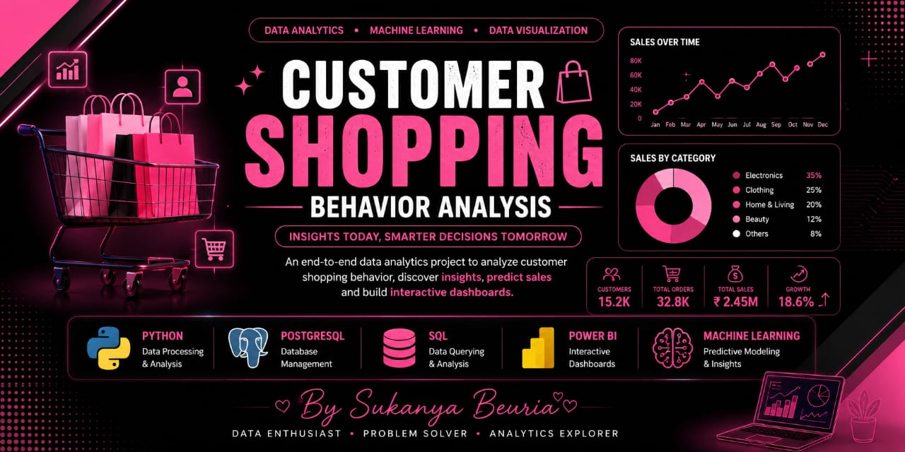

# 🛍️ Customer Shopping Behavior Analysis


<p align="center">
  
</p>
---

## 📌 Overview

An end-to-end Data Analytics project that analyzes customer shopping behavior using **Python, SQL, PostgreSQL, Machine Learning, and Power BI**.

The project performs data cleaning, exploratory data analysis, customer segmentation, sales prediction, SQL analysis, and interactive dashboard creation.

---


# 🛍️ Customer Shopping Behavior Analysis
# 🚀 Features

- ✅ Data Cleaning
- ✅ Exploratory Data Analysis
- ✅ Feature Engineering
- ✅ Customer Segmentation (K-Means)
- ✅ Sales Prediction (Linear Regression)
- ✅ SQL Queries
- ✅ PostgreSQL Database
- ✅ Interactive Power BI Dashboard

---

# 🛠 Tech Stack

- 🐍 Python
- 🐼 Pandas
- 📊 Matplotlib
- 🎨 Seaborn
- 📈 Plotly
- 🤖 Scikit-Learn
- 🐘 PostgreSQL
- 🗄 SQL
- 📉 Power BI

---

# 📂 Project Structure

```
Customer-Shopping-Behavior-Analysis
│
├── python/
│   ├── main.py
│   ├── data_cleaning.py
│   ├── eda.py
│   ├── feature_engineering.py
│   ├── customer_segmentation.py
│   ├── sales_prediction.py
│   ├── dashboard.py
│   ├── visualization.py
│   └── database.py
│
├── sql/
│   ├── create_table.sql
│   ├── insert_data.sql
│   └── analysis_queries.sql
│
├── powerbi/
│
├── images/
│
├── README.md
└── requirements.txt
```

---

# 📊 Project Workflow

CSV Dataset

⬇

Data Cleaning

⬇

EDA

⬇

Feature Engineering

⬇

Customer Segmentation

⬇

Sales Prediction

⬇

SQL Analysis

⬇

Power BI Dashboard

---

# 📸 Project Screenshots

### Dashboard

(Add dashboard screenshot here)

### Sales Prediction

(Add screenshot)

### Customer Segmentation

(Add screenshot)

### SQL Analysis

(Add screenshot)

---

# ▶️ How to Run

```bash
git clone <repository-link>

cd Customer-Shopping-Behavior-Analysis

pip install -r requirements.txt

python python/main.py
```

---

# 📈 Future Improvements

- Streamlit Web App
- Real-Time Dashboard
- Customer Recommendation System
- Deep Learning Model
- Deployment on Cloud

---

## 👩‍💻 Author

**Sukanya Beuria**

B.Tech CSE Student

Aspiring Data Analyst | Machine Learning Enthusiast

⭐ If you like this project, don't forget to star the repository.

GitHub: https://github.com/sukanyabeuria